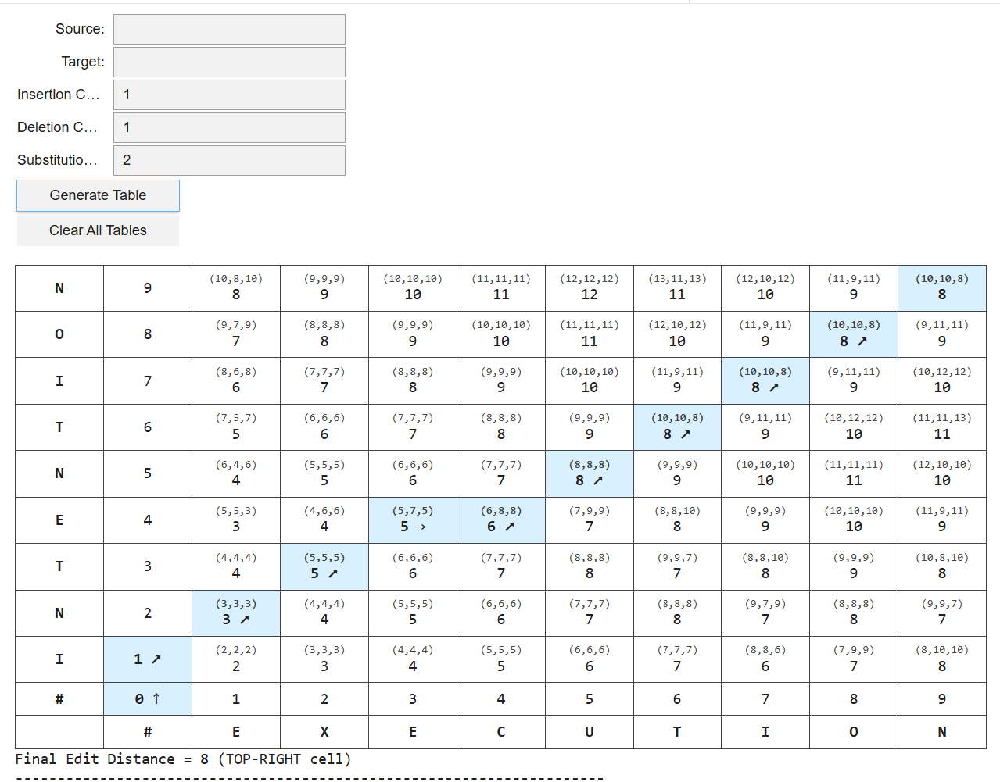
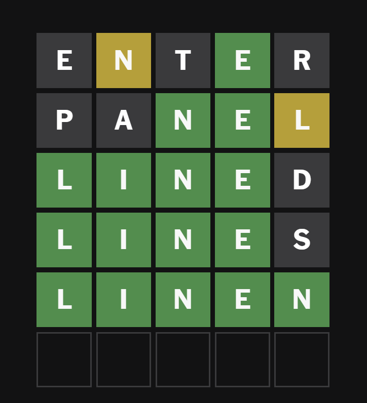
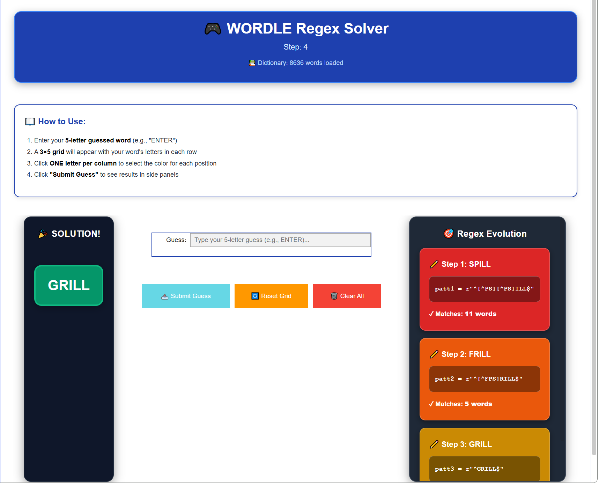

# Colab-Projects
A sandbox of simple codes ranging from simple NLP tools and string algorithms to entirely unrelated experiments created out of curiosity.

## 1. Jurafsky Style Minimum Edit Distance Table Generator

A visualization tool for computing and analyzing Minimum Edit Distance using the dynamic programming approach commonly presented in Jurafsky & Martin's computational linguistics framework.

### How to Use

1. Open the notebook in Google Colab.
2. Provide the source and target strings.
3. Set operation costs (insertion, deletion, substitution).
4. Generate the table to visualize candidate computations.
5. Inspect the optimal backtrace path and final edit distance.

### UI Preview

---

## 2. Wordle RegEx Generator

An interactive Google Colab tool that generates a Regular Expression (RegEx) pattern based on how you played a specific instance of Wordle.  
The tool helps narrow down valid candidate words using feedback from the official Wordle game:  
https://www.nytimes.com/games/wordle/index.html

### Example Game Instance

---

### UI Preview

---

### How to Use

1. Upload the `WORDLE.txt` file to the correct project path.
2. Mount your Google Drive.
3. Run the notebook script.
4. The script will automatically:
   - Check whether Google Drive is mounted.
   - Verify required dependencies are installed.
   - Ensure `WORDLE.txt` is accessible.
5. Once everything is ready, a UI will launch.

### 📖 Using the UI

1. Enter your 5-letter guessed word (e.g., "ENTER").
2. A 3×5 grid will appear with your word's letters displayed in each row.
3. Click **ONE letter per column** to select the color result for each position:
   - Green (correct position)
   - Yellow (correct letter, wrong position)
   - Gray (not in word)
4. Click **"Submit Guess"**.
5. The generated RegEx pattern will appear in the side panel.
6. Use the RegEx to filter candidate words from the word list.
